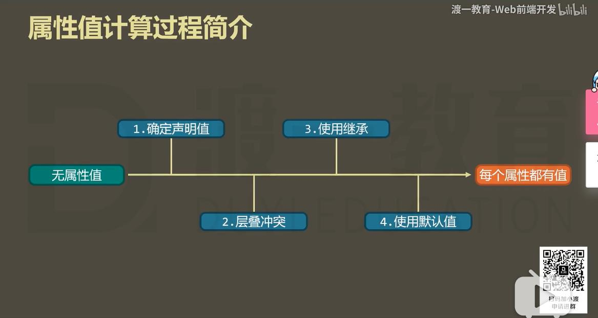
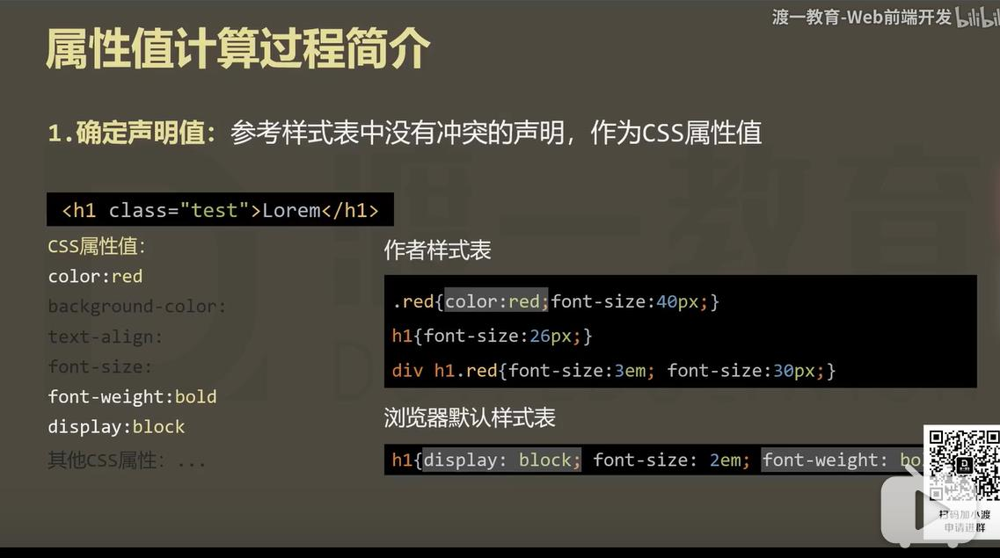
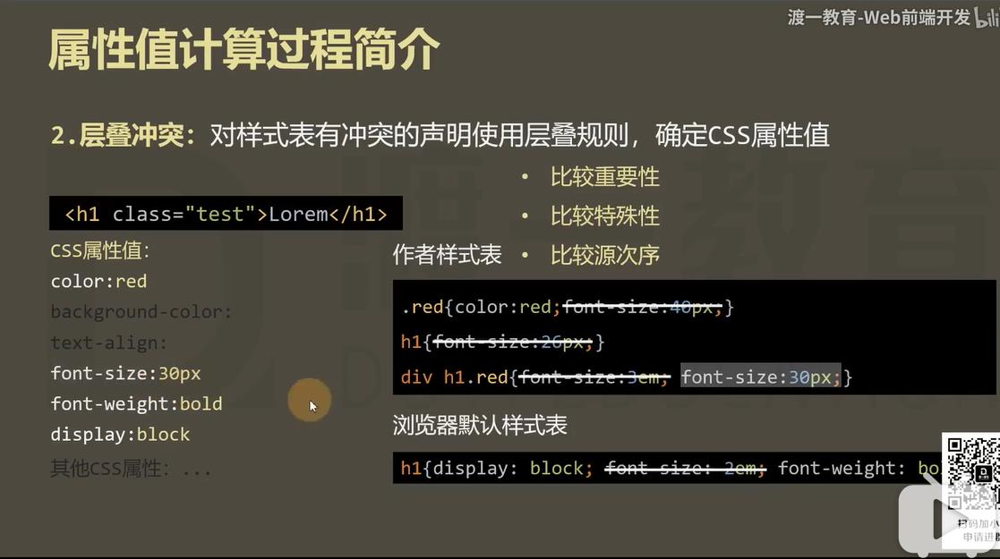

# 属性值的计算过程

一个元素一个元素依次渲染， 顺序按照页面文档的树形目录结构进行

渲染每个元素的前提条件: 该元素的所有CSS属性必须有值

一个元素, 从所有属性都没有值， 到所有的属性都有值，这个计算过程，叫做属性值计算过程

特殊的两个CSS取值:

- inherit: 手动 (强制) 继承， 将父元素的值取出应用到该元素
- initial: 初始值， 将该属性设置为默认值

